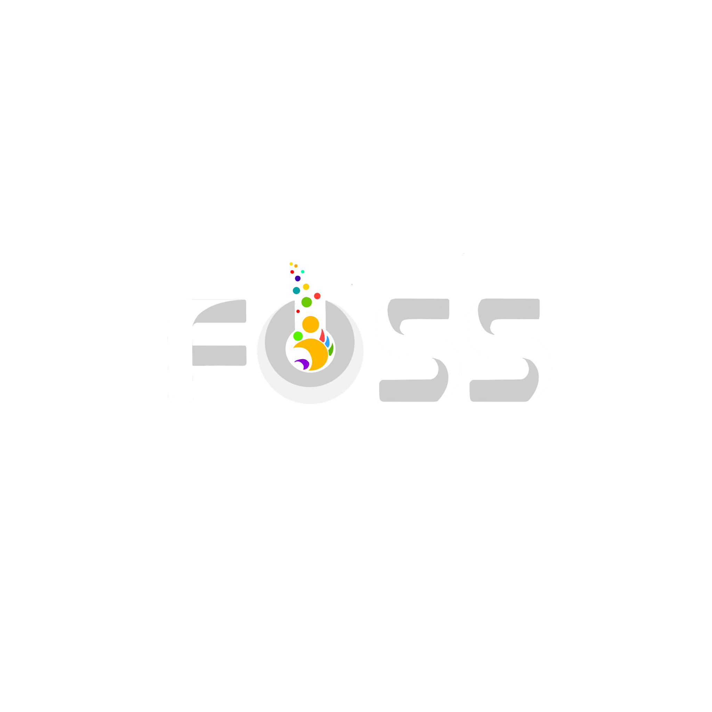

<p align="center">
  <a href="https://sliitfoss.org" target="_blank">
    <picture>
      <source media="(prefers-color-scheme: dark)" srcset="./public/logo-light.png">
      <source media="(prefers-color-scheme: light)" srcset="./public/logo-dark.png">
      
    </picture>
  </a>
  <br>
  
  
  
</p>

<br>

The official website of the SLIIT FOSS Community.

<br>

## Contributing

Contributions are what make the open source community such an amazing place to learn, inspire, and create. Any contributions you make are **greatly appreciated**. Please refer to our contributing guidelines or open an issue to discuss your ideas.

## Figma

The design system and UI mockups for the website are maintained in our Figma workspace.

## Development Flexibility

This project is built with flexibility and performance in mind using modern web technologies. It is developed using:

- **[Next.js](https://nextjs.org/)** + **[React](https://react.dev/)**
- **[Tailwind CSS](https://tailwindcss.com/)** for styling
- **[Motion](https://motion.dev/)** & **Three.js** for animations and 3D graphics
- **pnpm** for package management

## Deployment

- The website will be available under the domain [https://sliitfoss.org](https://sliitfoss.org)
- The deployment process has been fully automated and will work seamlessly for future updates via our CI/CD pipelines.

## Getting started

First, install the required dependencies using pnpm:

```bash
pnpm install
```

Run the development server:

```bash
pnpm dev
```

Open [http://localhost:3000](http://localhost:3000) with your browser to see the result. You can start editing the page by modifying `app/page.tsx`. The page auto-updates as you edit the file.

## PR & Commit Guidelines for SLIIT-FOSS

**1. Title**  
Short, describes the change, starts with a capitalized type:  
`Feat:`, `Fix:`, `Docs:`, `Chore:`, `Refactor:`, `Style:`

- ✅ `Feat: customize become-member button`
- ❌ `Feature/member button customize`

_Note: Our commitlint requires a capitalized type — `lowercase feat:` will be rejected._

**2. Link the issue**  
Put `Closes #<number>` in the PR description so it's tracked and auto-closes once merged.

**3. Branch from `dev`, target `dev`**

```bash
git fetch upstream
git checkout -b feat/my-change upstream/dev
```

This keeps your diff to only your changes — no unrelated files.

**4. One PR = One thing**  
Keep it focused. Don't bundle unrelated changes.

**5. Fill the PR template**  
Complete the PR template and add a screenshot for any UI change.

**6. Test locally before pushing**

```bash
pnpm dev
```
